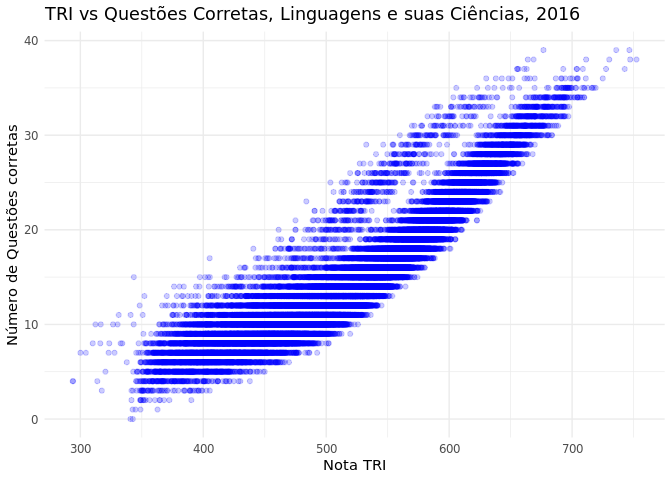
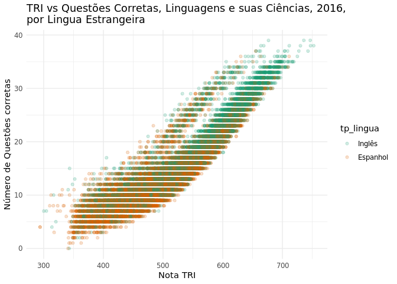
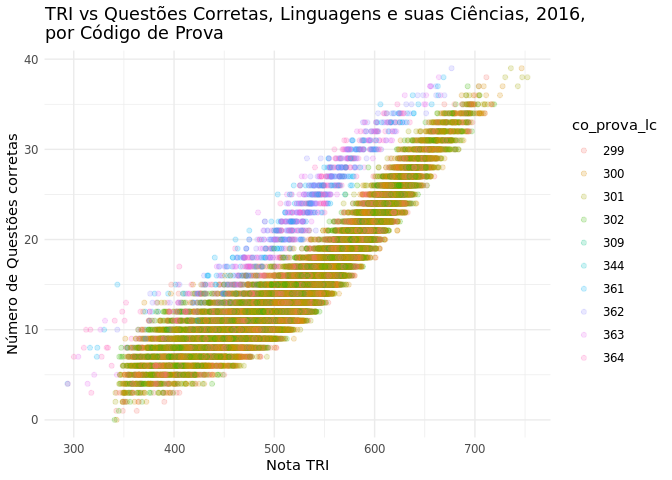
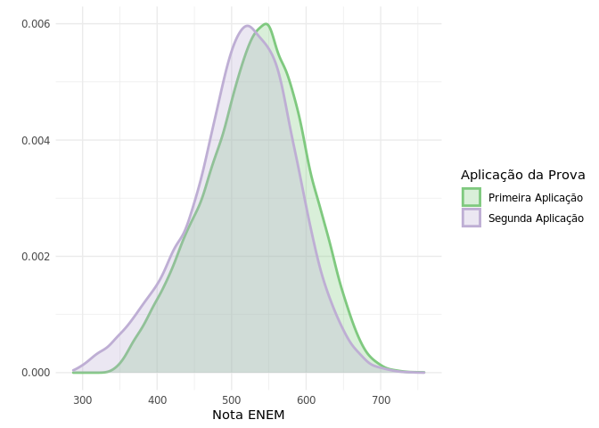

O que aconteceu em 2016 em Linguagem e suas Ciências?
================
Eduardo Bonet
5/14/2020

# Problema

Como vemos na (com código de reprodução ao longo do documento),
observamos que a relação entre a nota que um aluno recebeu no Enem e o
número de questões corretas possuem um formato bem definido, exceto na
prova de Linguagens e sua Ciências em 2016. 

Ao contrário das outras, a distribuição de notas para um mesmo número de
acertos é bimodal, em vez de gaussiana. Isso é preocupante, pois pode
indicar que houve error na computação das notas, ou que uma porção da
população esteve em desvantagem. Entender a razão por trás dessa
diferença é fundamental.

# Carregando os dados

Instruções sobre como preparar os dados podem ser encontradas no Readme
do projeto.

``` r
conn <- create.db.connection(config_file="../../config.json")

DBI::dbGetQuery(conn, "select setseed(0.7)")
```

    ## Warning in postgresqlExecStatement(conn, statement, ...): RS-DBI driver warning:
    ## (unrecognized PostgreSQL field type void (id:2278) in column 0)

    ##   setseed
    ## 1

``` r
query <- "
SELECT * FROM microdados
WHERE nu_ano=2016 AND tp_presenca_lc=TRUE AND random() < .01
ORDER BY random()
limit 40000

"

data <- DBI::dbGetQuery(conn, query)

head(data)
```

    ##   nu_inscricao nu_ano co_municipio_residencia tp_presenca_cn tp_presenca_ch
    ## 1 160001404375   2016                 3205002           TRUE           TRUE
    ## 2 160000272504   2016                 3509502           TRUE           TRUE
    ## 3 160003655949   2016                 2408102           TRUE           TRUE
    ## 4 160001566828   2016                 1506807           TRUE           TRUE
    ## 5 160002516999   2016                 4309308           TRUE           TRUE
    ## 6 160004139329   2016                 2304400           TRUE           TRUE
    ##   tp_presenca_lc tp_presenca_mt co_prova_cn co_prova_ch co_prova_lc co_prova_mt
    ## 1           TRUE           TRUE         294         298         302         306
    ## 2           TRUE           TRUE         294         298         302         306
    ## 3           TRUE           TRUE         293         297         301         305
    ## 4           TRUE           TRUE         293         297         299         303
    ## 5           TRUE           TRUE         292         296         299         303
    ## 6           TRUE           TRUE         291         295         300         304
    ##   nu_nota_cn nu_nota_ch nu_nota_lc nu_nota_mt
    ## 1      413.7      525.9      496.9      407.3
    ## 2      540.2      563.1      543.0      622.0
    ## 3      424.6      520.9      524.3      419.0
    ## 4      472.8      492.8      519.7      459.0
    ## 5      366.2      500.3      425.1      510.4
    ## 6      444.5      533.2      549.6      409.2
    ##                                 tx_respostas_cn
    ## 1 EDDEABEDBABAADCDEDBAAEDADACBBDEBBDECCDAADDBDB
    ## 2 DEAEDECEBDDAABDBDABDCEDADECBBDBEEBDBCDEEAABCA
    ## 3 ADEBCDBCECDACACDEACBCABBCEDEDBABADEDACACABADD
    ## 4 ABDBDADEACDAADABCADACABEDCBCCDCBBADBABACDCADC
    ## 5 AEAEADAAACCBAECACACABADBBCBEBBABBDDCDADABDEDD
    ## 6 ADDCBDCAADBEACBADBACCBDCACACDEECDBEECBECACBDA
    ##                                 tx_respostas_ch
    ## 1 ADCDECBDBCEEDBEABEDEBDCCAABCDABAAEBACABADCCDB
    ## 2 BDBEBDACECACDAEBBAADEDBEEAEADEAAAADDBABDEEEAE
    ## 3 EDAAABAADADBCCABCCECEACDBDCAADBDEAEBADADAADBC
    ## 4 ACEEBAACEEBBABAEEEBEABDBEADBDBCECAEDADDAAEBDA
    ## 5 ACCCCABAACEEDCCCBCAEBACACDCADCACCEACABBBDDACA
    ## 6 EBABABDDDCBCACACACBCEEBCABCAADDEDDBDDDBCAADBD
    ##                                      tx_respostas_lc
    ## 1 99999AEDADAEEBCAEBCECDEBECBACDBADBADEEEDAECBADCACE
    ## 2 99999BECDBABEBCAACCDBCEDCCDADAEAEAACEDCAECEEDBEADB
    ## 3 99999DCDAACAAACCCAECEDEBABEBBDABEDCCEBADEBEAACCBDA
    ## 4 99999AAABCAABBBBABAAEEEDEEDBAEAEBCBABAEDAADAABEEAC
    ## 5 99999EDABAAECCBADADEEEDDACACABEBDABCEBEECAADEAEEAA
    ## 6 99999CCBCDDAADDABBAAAAAADEDABACDDDDEEABCDCCBDACBEA
    ##                                 tx_respostas_mt tp_lingua
    ## 1 CCBBDACDBADDBCCCCDADB.CADCBAEDCBAECADBECBCBEA         1
    ## 2 CBEBDBDEDABEDBEBDCCBDBBDDBAEEBCBDCACDACBBCCDB         1
    ## 3 DCBAEBBCCDDEABDECBCBADBDBCABEDDBECABCCEACBACD         1
    ## 4 CADEAEDBEDADEBAAADACEAEABAEAE.DEBBCDBABBABBDA         1
    ## 5 BEDBCBCEADAEBBACDEEEAEABCEBCBBECDBCAAEAECAACA         1
    ## 6 EABABACDECACEDEBBCCDEDECABCCDDACACECECACEDCBD         1
    ##                                  tx_gabarito_cn
    ## 1 EADBDCCBADBEBCEBCABDEBEEBECADDBEACACDDBCADCCA
    ## 2 EADBDCCBADBEBCEBCABDEBEEBECADDBEACACDDBCADCCA
    ## 3 EBEECADBCABECDDBEADCCABDEABEBCADBADDCCCEDBBCA
    ## 4 EBEECADBCABECDDBEADCCABDEABEBCADBADDCCCEDBBCA
    ## 5 DBDCCACADBADBCABDEBEECECDDBCADCCBEBBEDBEAEACA
    ## 6 BCADBCEDCCBADBDCADBEBDBEADCCAEACDBEDBCACAEBEE
    ##                                  tx_gabarito_ch
    ## 1 EDDBDDACDCEDDACBBBCBCDCECADBEEBAAADECAECCBCAD
    ## 2 EDDBDDACDCEDDACBBBCBCDCECADBEEBAAADECAECCBCAD
    ## 3 DCECBAAADCBBECAEDCEDDACCBDDACEDDBADBCADBCBCEE
    ## 4 DCECBAAADCBBECAEDCEDDACCBDDACEDDBADBCADBCBCEE
    ## 5 EEBCBCEDDBDDACCCBCADADBAADEDDADCECAECBBBADCEC
    ## 6 BCBCCADCCBEDDBEEADBDCECCBBECAEEDDADCDDACAADBA
    ##                                       tx_gabarito_lc
    ## 1 EDECACCBBEDEBBBDABCBBCCEBADCEBAAEAAEDCBCABDBABEADE
    ## 2 EDECACCBBEDEBBBDABCBBCCEBADCEBAAEAAEDCBCABDBABEADE
    ## 3 EECDABBECCDAAECBBCBDABBAAEEBBDCBADEBABEADCECEBCABD
    ## 4 CEDEACCBEBDBABECABDADEADCEDCBEBBCEBAAEBAAECBBCBDAB
    ## 5 CEDEACCBEBDBABECABDADEADCEDCBEBBCEBAAEBAAECBBCBDAB
    ## 6 DECEACCEBBDADEBABEAAEDCBCABDCEBADCEBAAECBBCBDABEBB
    ##                                  tx_gabarito_mt tp_status_redacao nu_nota_comp1
    ## 1 CEECDBDADEBCCEBABECEACBDABDBDDABDDECADCCEACBA                 1           120
    ## 2 CEECDBDADEBCCEBABECEACBDABDBDDABDDECADCCEACBA                 1           140
    ## 3 CCEEBCCEBAABDDECADCEECDBCBDBECBADDACEAABDBDAD                 1           120
    ## 4 DADCCECBDECADCBACDBCEEABDDAABDBCEADDBECEBAEBC                 1           120
    ## 5 DADCCECBDECADCBACDBCEEABDDAABDBCEADDBECEBAEBC                 1           120
    ## 6 CBAACCEABDDCDBDDCEAECADBECEBACBDABDBEBCDADCEE                 1           120
    ##   nu_nota_comp2 nu_nota_comp3 nu_nota_comp4 nu_nota_comp5 nu_nota_redacao
    ## 1           120           120           120            80             560
    ## 2           120           100           120            40             520
    ## 3           100            80           100            40             440
    ## 4           100            80            80            60             440
    ## 5            60            60           140            20             400
    ## 6           120           100           120            60             520

Os dados possuem as respostas de cada usuário, e o gabarito de suas
respectivas provas. Para analisar o número de questões corretas,
precisamos comparar questão a questão:

``` r
parsed <- data %>%
      mutate_each(~strsplit(., ""), 
                  c(tx_respostas_cn,tx_respostas_ch,tx_respostas_lc,tx_respostas_mt, 
                    tx_gabarito_cn, tx_gabarito_ch, tx_gabarito_lc, tx_gabarito_mt)) %>%
      mutate(
        tx_corretas_lc = purrr::map2_chr(tx_respostas_lc, tx_gabarito_lc, ~paste0((.x == .y)*1, collapse = "")),
        n_corretas_lc = purrr::map2_int(tx_respostas_lc, tx_gabarito_lc, ~sum((.x == .y)))
      )
```

    ## Warning: `mutate_each_()` was deprecated in dplyr 0.7.0.
    ## Please use `across()` instead.

``` r
head(parsed[,c("tx_corretas_lc", "n_corretas_lc")])
```

    ##                                       tx_corretas_lc n_corretas_lc
    ## 1 00000000000101000110000000000001001000001001100101            11
    ## 2 00000000000001001010110000100001111000000000011110            14
    ## 3 00000000000110100000000010111101010001000010001000            13
    ## 4 00000000000001001101010101100100001100001000000010            13
    ## 5 00000000000000000010010100010001001000000000000010             7
    ## 6 00000110001100011011000000000000100001010011110000            15

Tendo o número de questões corretas, podemos visualizar como a nota TRI
se compara com a nota clássica:

``` r
ggplot(parsed %>% filter(nu_nota_lc > 0)) +
  geom_point(aes(x=nu_nota_lc, y=n_corretas_lc), alpha=.2, colour="blue") +
  labs(x="Nota TRI", y="Número de Questões corretas") +
  ggtitle("TRI vs Questões Corretas, Linguagens e suas Ciências, 2016")
```

<!-- -->

Observamos claramente um comportamento único nessa edição: existem dois
grupos distintos. Isso é problemático, por que mostra que alguns alunos
tiveram uma prova excepcionalmente difícil. Precisamos explorar melhor o
conjunto de dados para entender o que está acontecendo. O primeiro
motivo para a existência de provas diferentes é a escolha de diferente
língua estrangeira. Podemos verificar a diferença:

``` r
ggplot(
  parsed %>% 
    mutate(tp_lingua = as.factor(tp_lingua)) %>%
    filter(nu_nota_lc > 0)
  ) +
  geom_point(aes(x=nu_nota_lc, y=n_corretas_lc, color=tp_lingua), alpha=.2) + 
  labs(x="Nota TRI", y="Número de Questões corretas") +
  ggtitle("TRI vs Questões Corretas, Linguagens e suas Ciências, 2016,\npor Lingua Estrangeira") + 
  scale_color_brewer(palette = "Dark2", labels=c("Inglês", "Espanhol"), aesthetics = "colour" )
```

<!-- -->

Pelo gráfico, observamos que dividir por língua estrangeira não dividiu
muito bem os dois grupos, logo não é um bom candidato para o causador do
problema. A próxima razão para provas diferentes é provas de cor
diferente. A princípio, provas com core diferentes continuam tendo as
mesmas questões, mas com ordem diferente, e não causariam o problema
visto. Mesmo assim, vamos verificar:

``` r
ggplot(
  parsed %>% 
    mutate(co_prova_lc = as.factor(co_prova_lc)) %>%
    filter(nu_nota_lc > 0)
  ) + 
  labs(x="Nota TRI", y="Número de Questões corretas") +
  ggtitle("TRI vs Questões Corretas, Linguagens e suas Ciências, 2016,\npor Código de Prova") + 
  geom_point(aes(x=nu_nota_lc, y=n_corretas_lc, fill=co_prova_lc, color=co_prova_lc), alpha=.2)
```

<!-- -->

Por incrível que pareça, o código da prova divide perfeitamente os dois
grupos. Mais especificamente, códigos de prova com valores mais ficam
mais para cima e para a esquerda que códigos de valores mais baixos, ou
seja, para um mesmo número de questões certas, as provas com código mais
alto tiraram uma nota TRI maior, indicando que essas provas são mais
difíceis. Mas o código da prova não deveria influenciar em nada, então o
que está acontencendo?

Olhando no dicionário de dados, encontramos um fato interessante: os
códigos mais altos se referem a provas reaplicadas. Pesquisando mais
fundo, em 2016 o Enem foi reaplicado para uma parcela dos alunos em
outra data, devido a prostestos e ocupações das escolas que occoreram na
época, o que tornou vários pontos de prova inacessíveis.

Podemos olhar mais em detalhe a diferença entre os dois grupos, mar para
isso precisamos reamostrar nossos dados: apenas 100 alunos dos 40000
selecionados fizeram a prova em outro dia, e ao selecionar
aleatoriamente sem levar isso em conta teremos um conjunto de dados
desbalanceado. Selecionaremos 20000 alunos que fizeram a prova antes, e
20000 alunos que fizeram a prova depois.

``` r
parsed %>% 
  mutate(reaplicado = as.factor(ifelse(co_prova_lc %in% c(299, 300, 301, 302), 0, 1))) %>%
  select(reaplicado) %>%
  summary()
```

    ##  reaplicado
    ##  0:38955   
    ##  1: 1045

``` r
query2 <- "

SELECT * FROM (
    SELECT *, 0 as reaplicada FROM microdados
    WHERE nu_ano=2016 AND tp_presenca_lc=TRUE AND (CASE WHEN co_prova_lc < 341 THEN random() <.4 ELSE FALSE END) 
    limit 40000
  ) as A UNION (
    SELECT *, 1 as reaplicada FROM microdados
    WHERE nu_ano=2016 AND tp_presenca_lc=TRUE AND co_prova_lc >= 341
    limit 20000
  )
"

data2 <- DBI::dbGetQuery(conn, query2)
```

``` r
head(data2)
```

    ##   nu_inscricao nu_ano co_municipio_residencia tp_presenca_cn tp_presenca_ch
    ## 1 160000672592   2016                 3304557           TRUE           TRUE
    ## 2 160000672599   2016                 3203346           TRUE           TRUE
    ## 3 160000672601   2016                 1702554           TRUE           TRUE
    ## 4 160000672605   2016                 3121605           TRUE           TRUE
    ## 5 160000672613   2016                 2909802           TRUE           TRUE
    ## 6 160000672614   2016                 3552205           TRUE           TRUE
    ##   tp_presenca_lc tp_presenca_mt co_prova_cn co_prova_ch co_prova_lc co_prova_mt
    ## 1           TRUE           TRUE         294         298         299         303
    ## 2           TRUE           TRUE         292         296         299         303
    ## 3           TRUE           TRUE         294         298         301         305
    ## 4           TRUE           TRUE         293         297         299         303
    ## 5           TRUE           TRUE         294         298         301         305
    ## 6           TRUE           TRUE         294         298         301         305
    ##   nu_nota_cn nu_nota_ch nu_nota_lc nu_nota_mt
    ## 1      598.7      582.1      626.1      650.8
    ## 2      446.6      547.8      463.4      430.5
    ## 3      401.7      488.1      403.1      479.4
    ## 4      436.3      511.0      536.5      418.3
    ## 5      455.0      395.7      418.2      349.4
    ## 6      479.9      583.2      589.9      399.6
    ##                                 tx_respostas_cn
    ## 1 AEBBDBDBADDDCCBBDAADEABBBBCCADBAEADCEEBCEADCA
    ## 2 BEEDCDABDACDBDCBDADCACEDCCBDDDCAACDAADDEBAECB
    ## 3 DEDAACDCABCAEBDDBCEBCDACBDADBDCECBCDBEAECCDEB
    ## 4 DEDAEDBBEBDACADCCECECBAABCCDECEBADBDADDEBBDBA
    ## 5 CBEDEEDBCEDEDCBABCADADACDEDECBCBBCBDCBCBADBAB
    ## 6 CABDACEADECDBBABCDBCECDBDDCADBCEEDACABECADBED
    ##                                 tx_respostas_ch
    ## 1 BBDDBAABCBECDACBBEABBBBEEADEAEADACDDCEDCAAABD
    ## 2 AEACCDBDACCBBCDEEBBAAADAADEDACECDDAAAABBADDEE
    ## 3 BDAADCDCEBCCDBADBBECBDBCDBECDCAAAEBBBADDDCABC
    ## 4 DEEEBDACDACECDABECDCDACEEECDCBBCDAABCAAADDAAC
    ## 5 CAEEDEDBCCCAAEADEACADEBBCEEBDAAAAEEDCECDEDAAA
    ## 6 BDCEBDDBCCEADBCEBECDADAECBCCEEBDACCCDABDECCBD
    ##                                      tx_respostas_lc
    ## 1 CEDEA99999ABEBDCABDADDAEAEEACDBCAECAAEBBADCCBBCDAE
    ## 2 99999BEAECDACBCAACAADBEBADCDABABEEECABAEAAADDECADA
    ## 3 CDDBC99999DAACCDDDBBDEDDBADECEDDACBDCCBCEECCDECDBB
    ## 4 99999ADBBCAABBECABDAEBDDDEDADDEBEEAAADCAACBDEBECED
    ## 5 BCDAA99999CEECCDDEEEDCABCABBCDAAAACAAECEBEDEABBCBB
    ## 6 EBCDA99999BAACCEDCEBBCEBDCEBBAECAEDBDBCADEECEADAAE
    ##                                 tx_respostas_mt tp_lingua
    ## 1 EADCEECEDEEEEEDABDAEEEADCACDBECAEACDAECBADECA         0
    ## 2 CDDBAEDDACDDBECEDBCCCEEBBDBEADCADCADCBECEBADA         1
    ## 3 CCDBADCDCBEECEEDCBCECDEECCDBDBDDACECDEBBECDEC         0
    ## 4 ACECADAEDCABADCECCBAAAEDBEACBACEDADBCCDCBD.CA         1
    ## 5 DCBBEACCCEECCEEBABDDCCAEDCCCCBABDAEDCEBECCEBA         0
    ## 6 DCBBCEDBCCCABBDCBAEDECBDCABEACEDBDEABDCBEACAB         0
    ##                                  tx_gabarito_cn
    ## 1 EADBDCCBADBEBCEBCABDEBEEBECADDBEACACDDBCADCCA
    ## 2 DBDCCACADBADBCABDEBEECECDDBCADCCBEBBEDBEAEACA
    ## 3 EADBDCCBADBEBCEBCABDEBEEBECADDBEACACDDBCADCCA
    ## 4 EBEECADBCABECDDBEADCCABDEABEBCADBADDCCCEDBBCA
    ## 5 EADBDCCBADBEBCEBCABDEBEEBECADDBEACACDDBCADCCA
    ## 6 EADBDCCBADBEBCEBCABDEBEEBECADDBEACACDDBCADCCA
    ##                                  tx_gabarito_ch
    ## 1 EDDBDDACDCEDDACBBBCBCDCECADBEEBAAADECAECCBCAD
    ## 2 EEBCBCEDDBDDACCCBCADADBAADEDDADCECAECBBBADCEC
    ## 3 EDDBDDACDCEDDACBBBCBCDCECADBEEBAAADECAECCBCAD
    ## 4 DCECBAAADCBBECAEDCEDDACCBDDACEDDBADBCADBCBCEE
    ## 5 EDDBDDACDCEDDACBBBCBCDCECADBEEBAAADECAECCBCAD
    ## 6 EDDBDDACDCEDDACBBBCBCDCECADBEEBAAADECAECCBCAD
    ##                                       tx_gabarito_lc
    ## 1 CEDEACCBEBDBABECABDADEADCEDCBEBBCEBAAEBAAECBBCBDAB
    ## 2 CEDEACCBEBDBABECABDADEADCEDCBEBBCEBAAEBAAECBBCBDAB
    ## 3 EECDABBECCDAAECBBCBDABBAAEEBBDCBADEBABEADCECEBCABD
    ## 4 CEDEACCBEBDBABECABDADEADCEDCBEBBCEBAAEBAAECBBCBDAB
    ## 5 EECDABBECCDAAECBBCBDABBAAEEBBDCBADEBABEADCECEBCABD
    ## 6 EECDABBECCDAAECBBCBDABBAAEEBBDCBADEBABEADCECEBCABD
    ##                                  tx_gabarito_mt tp_status_redacao nu_nota_comp1
    ## 1 DADCCECBDECADCBACDBCEEABDDAABDBCEADDBECEBAEBC                 1           160
    ## 2 DADCCECBDECADCBACDBCEEABDDAABDBCEADDBECEBAEBC                 1           120
    ## 3 CCEEBCCEBAABDDECADCEECDBCBDBECBADDACEAABDBDAD                 1           120
    ## 4 DADCCECBDECADCBACDBCEEABDDAABDBCEADDBECEBAEBC                 1           120
    ## 5 CCEEBCCEBAABDDECADCEECDBCBDBECBADDACEAABDBDAD                 1           120
    ## 6 CCEEBCCEBAABDDECADCEECDBCBDBECBADDACEAABDBDAD                 1           160
    ##   nu_nota_comp2 nu_nota_comp3 nu_nota_comp4 nu_nota_comp5 nu_nota_redacao
    ## 1           140           160           160           120             740
    ## 2           120           120           120           120             600
    ## 3           120           120           140            40             540
    ## 4           100           120           120           120             580
    ## 5            80            80            80            20             380
    ## 6           180           200           200           180             920
    ##   reaplicada
    ## 1          0
    ## 2          0
    ## 3          0
    ## 4          0
    ## 5          0
    ## 6          0

``` r
parsed2 <- data2 %>%
      filter(nu_nota_lc > 0) %>%
      mutate(
        reaplicada = as.factor(reaplicada),
        co_prova_lc = as.factor(co_prova_lc)
      ) %>%
      mutate_each(~strsplit(., ""), 
                  c(tx_respostas_cn,tx_respostas_ch,tx_respostas_lc,tx_respostas_mt, 
                    tx_gabarito_cn, tx_gabarito_ch, tx_gabarito_lc, tx_gabarito_mt)) %>%
      mutate(
        tx_corretas_cn = purrr::map2_chr(tx_respostas_cn, tx_gabarito_cn, ~paste0((.x == .y)*1, collapse = "")),
        tx_corretas_ch = purrr::map2_chr(tx_respostas_ch, tx_gabarito_ch, ~paste0((.x == .y)*1, collapse = "")),
        tx_corretas_lc = purrr::map2_chr(tx_respostas_lc, tx_gabarito_lc, ~paste0((.x == .y)*1, collapse = "")),
        tx_corretas_mt = purrr::map2_chr(tx_respostas_mt, tx_gabarito_mt, ~paste0((.x == .y)*1, collapse = "")),
        n_corretas_cn = purrr::map2_int(tx_respostas_cn, tx_gabarito_cn, ~sum((.x == .y))),
        n_corretas_ch = purrr::map2_int(tx_respostas_ch, tx_gabarito_ch, ~sum((.x == .y))),
        n_corretas_lc = purrr::map2_int(tx_respostas_lc, tx_gabarito_lc, ~sum((.x == .y))),
        n_corretas_mt = purrr::map2_int(tx_respostas_mt, tx_gabarito_mt, ~sum((.x == .y)))
      )
```

``` r
ggplot(parsed2) +
  geom_density(aes(x=nu_nota_lc, color=reaplicada, fill=reaplicada), size=1, alpha=.3) + 
  labs(color = "Aplicação da Prova", fill="Aplicação da Prova", x="Nota ENEM", y="") +
  scale_color_brewer(palette = "Accent", labels=c("Primeira Aplicação", "Segunda Aplicação"), aesthetics = c("colour", "fill") )
```

<!-- -->

Fica visível que a curva de notas da primeira aplicação é levemente mais
para a direita que a da segunda aplicação. Podemos ser um pouco mais
rigoros e usar um teste estatístico:

``` r
m <- lm(parsed2$nu_nota_lc ~ parsed2$reaplicada)
summary(m)
```

    ## 
    ## Call:
    ## lm(formula = parsed2$nu_nota_lc ~ parsed2$reaplicada)
    ## 
    ## Residuals:
    ##      Min       1Q   Median       3Q      Max 
    ## -225.725  -44.525    4.375   48.342  227.442 
    ## 
    ## Coefficients:
    ##                     Estimate Std. Error t value Pr(>|t|)    
    ## (Intercept)         530.8581     0.3438 1543.93   <2e-16 ***
    ## parsed2$reaplicada1 -17.6330     0.5956  -29.61   <2e-16 ***
    ## ---
    ## Signif. codes:  0 '***' 0.001 '**' 0.01 '*' 0.05 '.' 0.1 ' ' 1
    ## 
    ## Residual standard error: 68.75 on 59969 degrees of freedom
    ## Multiple R-squared:  0.01441,    Adjusted R-squared:  0.01439 
    ## F-statistic: 876.5 on 1 and 59969 DF,  p-value: < 2.2e-16

Traduzindo, temos uma evidência forte que as distribuições de notas são,
de fato, diferentes, com diferença de 6.8 pontos na média.

# O que tudo isso significa?

A conclusão obtida a partir desse estudo é preocupante. Ela mostra que
as provas originais e reaplicadas para Linguagem e suas Ciências não são
comparáveis, sendo que os alunos que fizeram a prova na dota correta
tiveram uma vantagem sistemática no geral, apesar da diferença entre as
duas notas ser menor na escala TRI do que na escala clássica.
Ironicamente, como em geral os alunos da segunda prova erraram muito
mais, o que foram melhor nessa prova tiraram notas melhores, por estarem
mais longe da média (como preve o cálculo TRI).

Essa diferença de notas (7 pontos na média) parece inicialmente pequena,
mas é o suficiente para eliminar um aluno que esteja tentando uma
concurso concorrido. Da mesma forma, alunos que foram muito bem na
segunda prova tiraram notas que seriam impossíveis para os alunos da
primeira prova, justamente por ser uma prova mais difícil, mesmo que os
alunos tenham habilidades similares.

Para ilustrar melhor, é como se os alunos da primeira prova tivessem
feito um teste de resistência onde deveriam correr 1km, enquanto os
alunos da segunda prova tiveram que correr 2km. Em média mais alunos
terminariam a prova de 1km, mas alguns desses alunos também conseguiriam
finalizar a prova de 2km, mas não tiveram oportunidade de mostrar isso,
por que sua corrida era limitada a 1km. Exemplo disso é que alguns anos
atrás o Enem teve sua primeira nota acima de 1000, exatamente em uma
prova considerada mais difícil que nos anos anteriores. Observamos o
mesmo aqui, obversando que os melhores 10% dos alunos que fizeram a
segunda prova tiraram em média x pontos a mais do que os que fizeram a
primeira prova.
