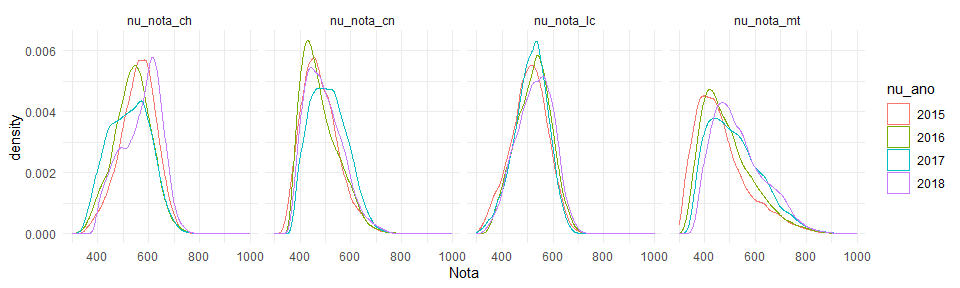
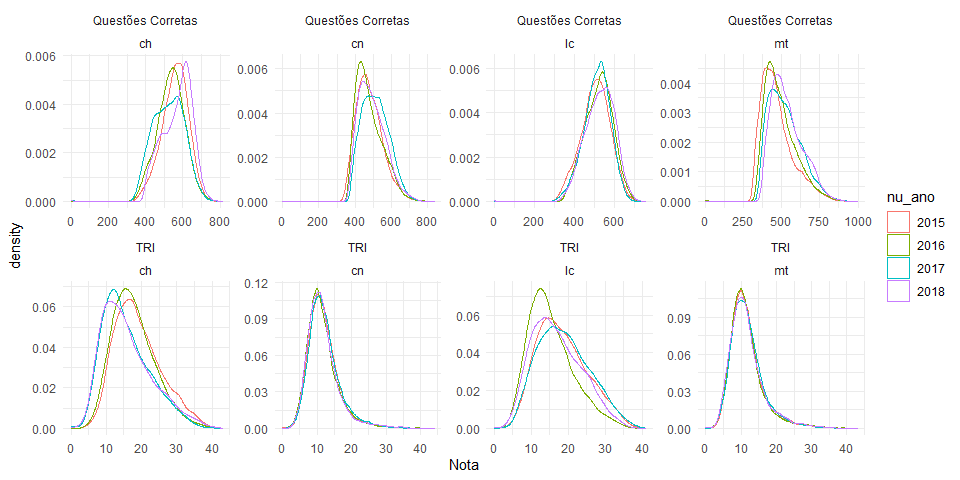
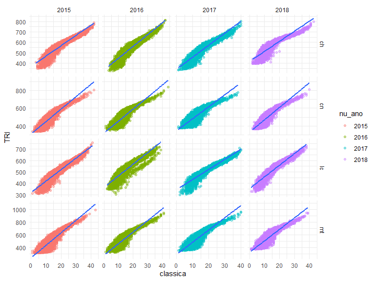

Análise Exploratória
================
Eduardo Bonet
5/14/2020

``` r
require("RPostgreSQL")
```

    ## Loading required package: RPostgreSQL

    ## Loading required package: DBI

``` r
library(ggplot2, warn.conflicts = FALSE)
library(tidyr, warn.conflicts = FALSE)
library(dplyr, warn.conflicts = FALSE)
library(rjson, warn.conflicts = FALSE)
```

``` r
drv <- dbDriver("PostgreSQL")

conf <- fromJSON(file="config.json")


# TODO read from local file
con <- dbConnect(
  drv, 
  dbname = conf$DB_NAME,
  host = conf$DB_HOST, 
  port = conf$DB_PORT,
  user = conf$DB_USER, 
  password = { conf$DB_PASSWORD }
)

do.query <- (function (conn) function (query) dbGetQuery(conn, query))(con)
```

  - Provas possuem questões em ordem diferente, é necessário remapear
    para que fiquem no mesmo padrão, ou focar em um tipo de prova.

<!-- end list -->

``` r
do.query("SELECT * FROM microdados limit 2")
```

    ##   nu_inscricao nu_ano co_municipio_residencia tp_presenca_cn tp_presenca_ch
    ## 1 180007197856   2018                 2111102           TRUE           TRUE
    ## 2 180007239581   2018                 2507507           TRUE           TRUE
    ##   tp_presenca_lc tp_presenca_mt co_prova_cn co_prova_ch co_prova_lc co_prova_mt
    ## 1           TRUE           TRUE         449         451         455         462
    ## 2           TRUE           TRUE         449         454         457         462
    ##   nu_nota_cn nu_nota_ch nu_nota_lc nu_nota_mt
    ## 1      521.0      568.7      513.1      480.3
    ## 2      461.8      564.0      466.8      538.8
    ##                                 tx_respostas_cn
    ## 1 ECEABBBDACBBBADEEDCBBCBCEBAACABEABECCEADEADCE
    ## 2 EEBCABEBAEBAAADEDDEBCADEDBABCDDADBEEACAAAADEE
    ##                                 tx_respostas_ch
    ## 1 AAEECCAEEBBEDEEEBEABEECAACECBCCCECAABAEBEDAED
    ## 2 BBEADEBECAECADDAAECDBDABEAEDBEEEACACBCBAAADCE
    ##                                      tx_respostas_lc
    ## 1 ECCEC99999CECEDCECAAABDDBADEEDBBAAEACCBCEBDECECDBB
    ## 2 99999BAAEEBAEEBEBAABEAAADBBBDDBEBCAAECECAEBBBABAEE
    ##                                 tx_respostas_mt tp_lingua
    ## 1 CACBEEDBDDAEAEDDABAAEEAEAEEABAEDAAAACEAABADAA         0
    ## 2 BEABADAACCEABDCDACACADAACBBAEEBDECCDAEABBBDDE         1
    ##                                  tx_gabarito_cn
    ## 1 EBBEBACEDDEDDCBCCACBDDDAECAADBCEABEAEABDBCACE
    ## 2 EBBEBACEDDEDDCBCCACBDDDAECAADBCEABEAEABDBCACE
    ##                                  tx_gabarito_ch
    ## 1 CACDDBDDECCEDEEEBCEAEECBBEBEDBEDECBEBDCAABCDE
    ## 2 CDECAABBDDECBEEDBEBBEBEDEEEBCEAEECECCDBDDCACD
    ##                                       tx_gabarito_lc
    ## 1 BBDECBBCDBCECBABDBEDACDDBBBEADECACEDBEBABCBEAECADA
    ## 2 CBEDBBBDCBECADBBBECBEAECABDADACDBABCECBBEDADABECED
    ##                                  tx_gabarito_mt tp_status_redacao nu_nota_comp1
    ## 1 ADCACEDDABEBBCBCADDACCCDEBBDAEEDBEXBCAEDABADA                 1           120
    ## 2 ADCACEDDABEBBCBCADDACCCDEBBDAEEDBEXBCAEDABADA                 1           120
    ##   nu_nota_comp2 nu_nota_comp3 nu_nota_comp4 nu_nota_comp5 nu_nota_redacao
    ## 1            40            40            60            20             280
    ## 2           120           120           120           100             580

``` r
data <- do.query("SELECT * FROM microdados ORDER BY random() limit 40000")
```

``` r
theme_set(theme_minimal())
df <- as.data.frame(data) %>% 
  filter(nu_ano > 2014) %>%
  mutate(nu_ano = as.factor(nu_ano))
```

``` r
pdata <- df %>% 
  select(nu_ano, nu_nota_cn, nu_nota_ch, nu_nota_lc, nu_nota_mt) %>%
  pivot_longer(-nu_ano, values_to = "Nota", names_to = "Prova") %>%
  filter(Nota > 0)

ggplot(pdata) +
  geom_density(aes(x=Nota, color=nu_ano)) +
  facet_grid(. ~ Prova)
```

<!-- -->

``` r
df %>% head()
```

    ##   nu_inscricao nu_ano co_municipio_residencia tp_presenca_cn tp_presenca_ch
    ## 1 160001931724   2016                 1400100           TRUE           TRUE
    ## 2 150006994211   2015                 3550308           TRUE           TRUE
    ## 3 180009892224   2018                 3538907           TRUE           TRUE
    ## 4 150003356648   2015                 5208707           TRUE           TRUE
    ## 5 170005708805   2017                 2903201           TRUE           TRUE
    ## 6 180007717301   2018                 3138203           TRUE           TRUE
    ##   tp_presenca_lc tp_presenca_mt co_prova_cn co_prova_ch co_prova_lc co_prova_mt
    ## 1           TRUE           TRUE         294         298         299         303
    ## 2           TRUE           TRUE         235         231         240         244
    ## 3           TRUE           TRUE         447         454         457         459
    ## 4           TRUE           TRUE         238         234         241         245
    ## 5           TRUE           TRUE         394         397         402         405
    ## 6           TRUE           TRUE         447         454         457         459
    ##   nu_nota_cn nu_nota_ch nu_nota_lc nu_nota_mt
    ## 1      515.3      516.1      557.0      514.7
    ## 2      513.3      597.4      545.4      496.9
    ## 3      585.4      634.8      597.3      644.2
    ## 4      485.0      593.6      538.6      392.4
    ## 5      508.4      458.3      535.9      401.4
    ## 6      473.5      529.5      400.5      435.4
    ##                                 tx_respostas_cn
    ## 1 DEAECBBEDBAEBCDBCDBAECAEBCADBAAEECDBACDAECCEB
    ## 2 DBEDBCACBCABDDCCADACDACCBEBCCBABEDEDBACEABCBA
    ## 3 ABBEADAACEECACBBAEBDEBABDDDDCBEECBDBEAEEEBABE
    ## 4 CCAEDBADBBBBECDEDAAECDEBBDECCEAEDDEEBABCCBDDC
    ## 5 CACCAADBCAEDAAEABEDDBBBCBECDDBBDCEADBEEAADAED
    ## 6 DDEBBCCEEBDDBDEDECCBCBDABEBCCCECBEDAEDEEBADEE
    ##                                 tx_respostas_ch
    ## 1 CBEDDBACACEBDCCDEECABABCEAECDBBDAABEDABACEAAA
    ## 2 DEBEBDACEDCEDCDECABEEAAEBEEDEDCEABCBBCDAECBBB
    ## 3 ADDCACBAEAECBEEEACDABCEDBEADCECAEDECCCBACCDAE
    ## 4 EDDBCEAEBBDBDEEACDBCCABEACCCEEAAACECACAAABACA
    ## 5 ADAECBEABAEBEDAACDEBBCECBDCDCDAEDBDCBDAABAEAB
    ## 6 ABCBDDBBBBDDDAAEEEEBDCBBEEABBCDDDDDDDDDCBBCCE
    ##                                      tx_respostas_lc
    ## 1 99999CDABAEBCBBDCDBAEDEDCEBABEEEEBAAABBEACCAAECBAA
    ## 2 99999DADBDBECDBBAADAECCADCABEEAAACBDAEABAEDECEBCBE
    ## 3 CBDDB99999ACADBABCCDEBBCDBEEDACDBCDCAEBBACCAABCCDD
    ## 4 99999DADDCEBDCAABCDCEABEBCBCDBAAEEEDAECCCACBCBBBBA
    ## 5 99999CDBEABEEABEEEBCCDBAADBAEABDAABBCECBDDEECBDDCD
    ## 6 EBCAA99999EDACCECCEBBCBAEDDDDDCCDEEBEEDDDEBEACCCCC
    ##                                 tx_respostas_mt tp_lingua
    ## 1 DEEDCBCEAACECBDBDDBCBECADBCBABCAEDCEDAADBBACD         1
    ## 2 CBACBCCBBDCACACBBCCABCCBDCDDBDCDBBEDEBCEDCBAB         1
    ## 3 BADADDCEEBADEAEEDABDABBAADEECECDCDDEEBDCBEADD         0
    ## 4 ACDDDAEEECCBBDAEDCCACBAADDAAEEDDDCCABBAEEDCBA         1
    ## 5 DACABCDEAEADEADBBECACACBACBDEAEBBADDBBCAEACAA         1
    ## 6 EECEADCCECBAAAEDCABAAEDABABAABABDDBCBAAADEAED         0
    ##                                  tx_gabarito_cn
    ## 1 EADBDCCBADBEBCEBCABDEBEEBECADDBEACACDDBCADCCA
    ## 2 DCCDBCAAEBECBAADADBDEDEEBBBCABCCEAAEEDCBDDCEA
    ## 3 BDDEDBCACEBCCACDCDDAECAADBDBCEEAEAABEBEBBACED
    ## 4 DDCEEEABBBAADDEDBECBCABCAEDCBCAADBCEAAEEDCBCD
    ## 5 EEAAECDCCDADAADECDCBCDAAEDEEBABCEDDCBEBAABCBB
    ## 6 BDDEDBCACEBCCACDCDDAECAADBDBCEEAEAABEBEBBACED
    ##                                  tx_gabarito_ch
    ## 1 EDDBDDACDCEDDACBBBCBCDCECADBEEBAAADECAECCBCAD
    ## 2 AEAEADECEADEDBDACBBCEEECBADCEBCEACBBBDADCCABD
    ## 3 CDECAABBDDECBEEDBEBBEBEDEEEBCEAEECECCDBDDCACD
    ## 4 ADECAEAEDBDADEEACEBCECBACBBCEEBBDEACBCABDDADC
    ## 5 ECAEBCDDECADBEABDDBDBDAEBCCCCDEAEDAEBBEDABAEC
    ## 6 CDECAABBDDECBEEDBEBBEBEDEEEBCEAEECECCDBDDCACD
    ##                                       tx_gabarito_lc
    ## 1 CEDEACCBEBDBABECABDADEADCEDCBEBBCEBAAEBAAECBBCBDAB
    ## 2 AACDEBACDDBEDDCEABBAECCDCDDEEEABBABDCDABEBDBCECCBE
    ## 3 CBEDBBBDCBECADBBBECBEAECABDADACDBABCECBBEDADABECED
    ## 4 DEAACDCBDAEBDABBBEDEEBABDCDADBBEBDCDAECCEABDCECECC
    ## 5 DDCDEEDBEECEBADEDEABEDBBBDBCCABAAAABCBDAEDEDDBCDAE
    ## 6 CBEDBBBDCBECADBBBECBEAECABDADACDBABCECBBEDADABECED
    ##                                  tx_gabarito_mt tp_status_redacao nu_nota_comp1
    ## 1 DADCCECBDECADCBACDBCEEABDDAABDBCEADDBECEBAEBC                 1           120
    ## 2 EBCCBEEDABDBDECDACCEDCCECAAEADCBEDAEACABADDBB                 1           120
    ## 3 ACEADCEBBDADAAEBBDDEDABADBEXCCCDBCAEEACBCDDAB                 1           140
    ## 4 BADEBCCDACCCACAAECEADCBEDAEAABDEDCBDECDBBBEED                 1           100
    ## 5 BBDBADBEECDCCECAEBBDDEDDCCBBACADAEACEADABDECB                 1            80
    ## 6 ACEADCEBBDADAAEBBDDEDABADBEXCCCDBCAEEACBCDDAB                 1           120
    ##   nu_nota_comp2 nu_nota_comp3 nu_nota_comp4 nu_nota_comp5 nu_nota_redacao
    ## 1           120           120           120           120             600
    ## 2           120           120           100           140             600
    ## 3           120           120           120           100             600
    ## 4           120            80            80            80             460
    ## 5           100           100            80            60             420
    ## 6            40            40           120            40             360

## Número de questões corretas

``` r
n.corretas <- df %>%
  select(nu_inscricao, tx_respostas_cn, tx_gabarito_ch, tx_respostas_ch, tx_gabarito_cn, tx_respostas_lc, tx_gabarito_lc, tx_respostas_mt, tx_gabarito_mt) %>%
  mutate_each(~strsplit(., ""), -nu_inscricao) %>%
  mutate(
    tx_corretas_cn = purrr::map2_chr(tx_respostas_cn, tx_gabarito_cn, ~paste0((.x == .y)*1, collapse = "")),
    tx_corretas_ch = purrr::map2_chr(tx_respostas_ch, tx_gabarito_ch, ~paste0((.x == .y)*1, collapse = "")),
    tx_corretas_lc = purrr::map2_chr(tx_respostas_lc, tx_gabarito_lc, ~paste0((.x == .y)*1, collapse = "")),
    tx_corretas_mt = purrr::map2_chr(tx_respostas_mt, tx_gabarito_mt, ~paste0((.x == .y)*1, collapse = "")),
    n_corretas_cn = purrr::map2_int(tx_respostas_cn, tx_gabarito_cn, ~sum((.x == .y))),
    n_corretas_ch = purrr::map2_int(tx_respostas_ch, tx_gabarito_ch, ~sum((.x == .y))),
    n_corretas_lc = purrr::map2_int(tx_respostas_lc, tx_gabarito_lc, ~sum((.x == .y))),
    n_corretas_mt = purrr::map2_int(tx_respostas_mt, tx_gabarito_mt, ~sum((.x == .y)))
  ) %>% 
  select(
    nu_inscricao,
    tx_corretas_cn, tx_corretas_ch, tx_corretas_lc, tx_corretas_mt,
    n_corretas_cn, n_corretas_ch, n_corretas_lc, n_corretas_mt
  )
```

``` r
head(n.corretas)
```

    ##   nu_inscricao                                tx_corretas_cn
    ## 1 160001931724 000000000001110110101001100000010100000000100
    ## 2 150006994211 100111100000000011000000101101001000001000101
    ## 3 180009892224 000100011101000000001010101010100001101000000
    ## 4 150003356648 000100101100000000001000000100101001010000000
    ## 5 170005708805 000000101001110000000000000000100000110110000
    ## 6 180007717301 010000100000000100000001000010100000101011010
    ##                                  tx_corretas_ch
    ## 1 000010110110101000100000010000101101010010010
    ## 2 010101011001101010101000100010111001100001010
    ## 3 010110100011111000000011010011001011101001000
    ## 4 010001110110111110110010000111000001011000100
    ## 5 001100000000001001001000101011000000100000000
    ## 6 000000110000000001010000110100000000010000010
    ##                                       tx_corretas_lc
    ## 1 00000100000101000001000111001100000110101010000010
    ## 2 00000010011101001001111000001110001100110010110111
    ## 3 11011000000111101010100101001111100100110000110101
    ## 4 00000100101110001010100001001100000111110100100000
    ## 5 00000011100101010100011001100110110110000110010100
    ## 6 01000000001010000001000000101010000010000000100100
    ##                                  tx_corretas_mt n_corretas_cn n_corretas_ch
    ## 1 100010100010000001110100100000001000000010000            12            16
    ## 2 010110000000001001100110000001100000000000001            15            20
    ## 3 000110000011011000000011001010110001100000000            14            20
    ## 4 001000000110001001010000100100101100000000000            10            21
    ## 5 000000010000000000000000011000000000000100000            10            10
    ## 6 000000000000111000000001000000000000010000000            11             9
    ##   n_corretas_lc n_corretas_mt
    ## 1            15            11
    ## 2            23            11
    ## 3            25            14
    ## 4            18            11
    ## 5            21             4
    ## 6            10             5

``` r
df <- df %>% bind_cols(n.corretas)
```

``` r
pdata <- df %>% 
  select(
    nu_ano, 
    n_corretas_cn, n_corretas_ch, n_corretas_lc, n_corretas_mt,
    nu_nota_cn, nu_nota_ch, nu_nota_lc, nu_nota_mt
    ) %>%
  filter(nu_nota_cn  > 10 && nu_nota_ch > 10 && nu_nota_lc > 10 && nu_nota_mt > 10 ) %>% 
  pivot_longer(-nu_ano, values_to = "Nota", names_to = "Coluna") %>%
  separate(Coluna, c("Trash", "Metrica", "Prova"), sep="_") %>%
  mutate(Metrica = ifelse(Metrica == "nota", "Questões Corretas", "TRI"))
  


ggplot(pdata) +
  geom_density(aes(x=Nota, color=nu_ano)) +
  facet_wrap(Metrica ~ Prova, scales="free", ncol = 4)
```

<!-- -->

``` r
pdata <- df %>% 
  select(
    nu_ano, 
    n_corretas_cn, n_corretas_ch, n_corretas_lc, n_corretas_mt,
    nu_nota_cn, nu_nota_ch, nu_nota_lc, nu_nota_mt
    ) %>%
  filter((n_corretas_cn  > 0) & (n_corretas_ch > 0) & (n_corretas_lc > 0) & (n_corretas_mt > 0) ) %>% 
  pivot_longer(-nu_ano, values_to = "Nota", names_to = "Coluna") %>%
  separate(Coluna, c("Trash", "Metrica", "Prova"), sep="_") %>%
  mutate(Metrica = ifelse(Metrica == "nota", "TRI", "classica")) %>%
  pivot_wider(id_cols = c(nu_ano, Prova), names_from = Metrica, values_from = Nota, values_fn = list(Nota = list)) %>%
  unnest(cols = c(TRI, classica))

ggplot(pdata) +
  geom_point(aes(x=classica, y=TRI, color=nu_ano), alpha=.4) +
  facet_grid(Prova ~ nu_ano, scales="free") + 
  geom_smooth(aes(x=classica, y=TRI), method='lm', formula= y~x)
```

<!-- -->

  - A relação TRI \~ Classica não é linear no geral
  - A partir de 25 acertos, TRI \~ Classica pode ser aproximado por um
    modelo linear
  - Antes dos 25 acertos, a curva é menos linear. Provavelmente por que
    o número de combinações corretas para chegar naquele ponto é maior,
    além de ser mais fácil de chegar por chute.

## A Cor da prova faz diferença?
